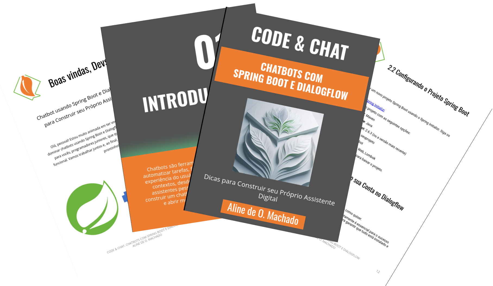

    

-------

# Projeto EBOOK Gerado por I.A.s

Projeto com o objetivo de gerar um ebook digital com as facilidades das ferramentas de IA. todos os prompts
seguem abaixo.

<a href="https://github.com/alinemach/prompts-recipe-to-create-a-ebook/blob/main/output/Code%20%26%20Chat%20Chatbots%20com%20Spring%20Boot%20e%20Dialogflow.pdf" title="View PDF now"> 📕Clique aqui para ler</a>

## 💻 Tecnologias utilizadas no projeto

- [ChatGPT](https://chat.openai.com/) 
- [Adobe Firefly](https://firefly.adobe.com/)
- [Google Slides](https://docs.google.com/presentation/create&ved=2ahUKEwj_6uyO-LCHAxUxLbkGHUEwA3IQFnoECAoQAQ&usg=AOvVaw0qwAotxOEbw6--cWglYgOc)

## 🧠 Prompts

ChatGPT：

|   Ação   | prompt                                                                                                                                                                                                                                                                         |
| :------: | ------------------------------------------------------------------------------------------------------------------------------------------------------------------------------------------------------------------------------------------------------------------------------ |
|  título  | Crie um título de um ebook sobre o criar chat usando Spring Boot e Dialogflow. faça trocadilhos com termos do mundo dev                                                        |
| guardar na memória | act like a senior software engineer teaching tecnical skills to a junior developer. keep it on memory |
| conteúdo | Escreva um ebook com o titulo "Code, Chat: Domine Chatbots com Spring Boot e Dialogflow"  e subtitulo "Dicas para Construir seu Próprio Assistente Digital" para programadores juniors.|
| conteúdo |divida o ebook em capitulos, subcapitulos e topicos|
| conteúdo |utilize linguagem amigável e simples|
| conteúdo |use termos como "pessoal, galera dev, queridos devs, vocês, você, parceiros" para se dirigir ao leitor, você pode usar outros termos também para não ser muito repetitivo.|
| conteúdo |explique o motivo de ter tomado cada decisão e utilize termos como: "acredito, perceba que, veja que, leve em consideração que, porque decidi isso ao inves daquilo" para enfatizar isso. |
| conteúdo |use outros termos que você achar convenientes de modo que mantenha o leitor interessado no assunto, mas seja sempre cordial e confiante que o projeto vai dar certo e mantenha o profissionalismo.|
| conteúdo |não use girias|
| conteúdo |explique como o ambiente para criar o projeto deve ser criado |
| conteúdo |faça um projeto simples, funcional, pratico e completo de um chatbot com spring boot e dialogflow|
| conteúdo |seja especifico e cuidadoso com os codigos que deverão ser copiados pelos leitores. Não podem haver erros.|
| conteúdo |fonerceça exemplos e caminhos no final do ebook para caso eles queiram implementar outras features ao projeto feito por você. |

Adobe Firefly：

|  Ação  | prompt                                                                                 |
| :----: | -------------------------------------------------------------------------------------- |
| composition reference| Dialogflow logo |
| style reference| Spring Boot logo |
| prompt itself | union of composition and style references with digital art with plaster relief effect |

## ✨ Features

- Conteúdo gerado via ChatGPT
- Imagens geradas via Firefly

## 📚 Materiais

- Imagens utilizadas em `assets`
- ebook em `output`

## 🛠️ Instruções de execução

Utilize os prompts acima nas ferramentas sugeridas para gerar o material base e utilize uma ferramenta de edição de documentos como power point, libreoffice , indesign para diagramação.

## 👨‍💻 Expert

    
    
&nbsp&nbsp&nbspAline de Oliveira Machado 
    &nbsp&nbsp&nbsp
    <a href="https://github.com/alinemach">
    GitHub</a>&nbsp;|&nbsp;
    <a href="www.linkedin.com/in/
alinemach">LinkedIn</a>
&nbsp;|&nbsp;

  

---

Feito com carinho por [Aline de Oliveira Machado](https://github.com/alinemach)